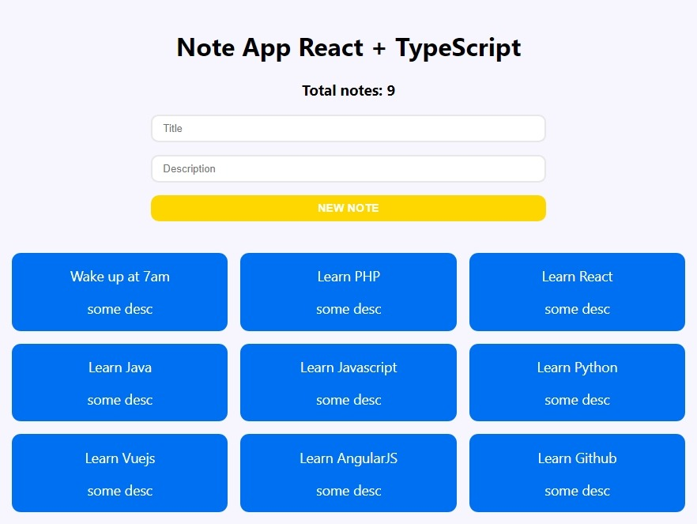

# React Context API with Typescript  

## Table of Content

- [About The Project](#about-the-project)
  - [Description](#description)
  - [Built With](#built-with)
- [Installation](#installation)
- [Usage](#usage)
- [Demo](#demo)
- [Contact](#contact)

## About The Project



## Description

This project is for a notes app, which I did to practice using the Context API that ReactJS has and also how to use it alongside Typescript.

The application has a global state that are the notes which are accessed by all the components, they also include the reducers that are to alter the global state when adding and deleting the notes. All of this global state is handled by the Context API.

## Built With

[](https://reactjs.org)

[](https://www.typescriptlang.org)

## Installation

1. Clone the repo and change "my-project" to your project name.

```sh
  git clone https://github.com/josemiguel02/react-context-api-ts.git ./my-project
```

2. Go to the project directory

```sh
  cd my-project
```

3. Install NPM packages

```sh
  npm install
```

## Usage

Run the project in development

```npm
  npm run dev
```

Build the project

```npm
  npm run build
```

## Demo

- [View demo](https://react-context-api-ts.pages.dev)

## Contact

- Gmail - [josemidev24@gmail.com](mailto:josemidev24@gmail.com)
- Instagram - [@jmdp.02](https://www.instagram.com/jmdp.02)
